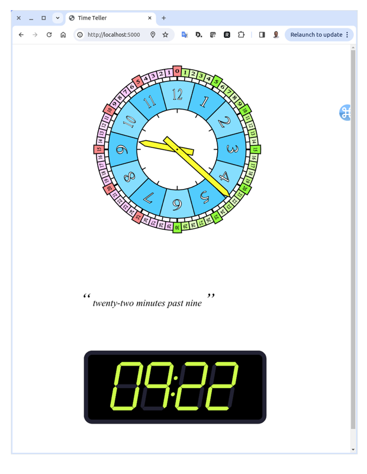

# timeteller

This is a small demo showing how an svg image can be generated in code.

In this instance the images show clock faces (both analogue and digital) that reflect the current time.

A flask server dishes up the page according to a simple API.

Run the flask server using the ```go_tt.sh``` command, you may need to edit this for a windows machine into a batch-equivalent.

An empty URL suffix will signal the server to display the current time (refresh the page to update)

Connecting to the flask server's address (default is `http://localhost:5000`) will provide an image of the current local time in both analogue and digital clock faces. 



To display times other than the local time, use the api below

```
/show/<time>/
```

where ```<time>``` is provided strictly in `HH:MM` format.

And the clock-faces displaying the time specified will be returned.
